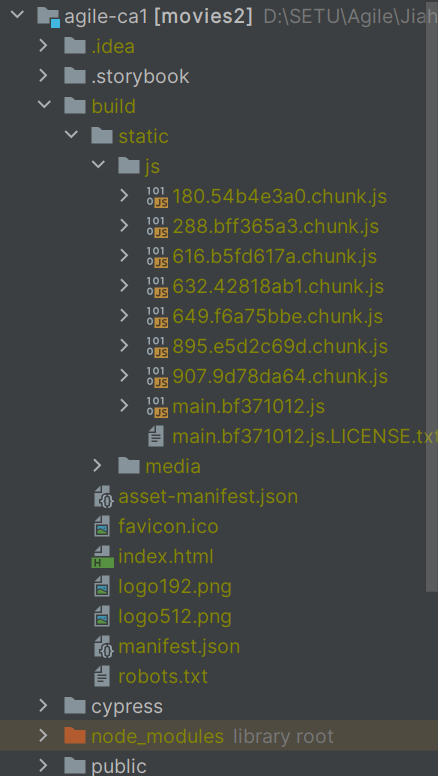
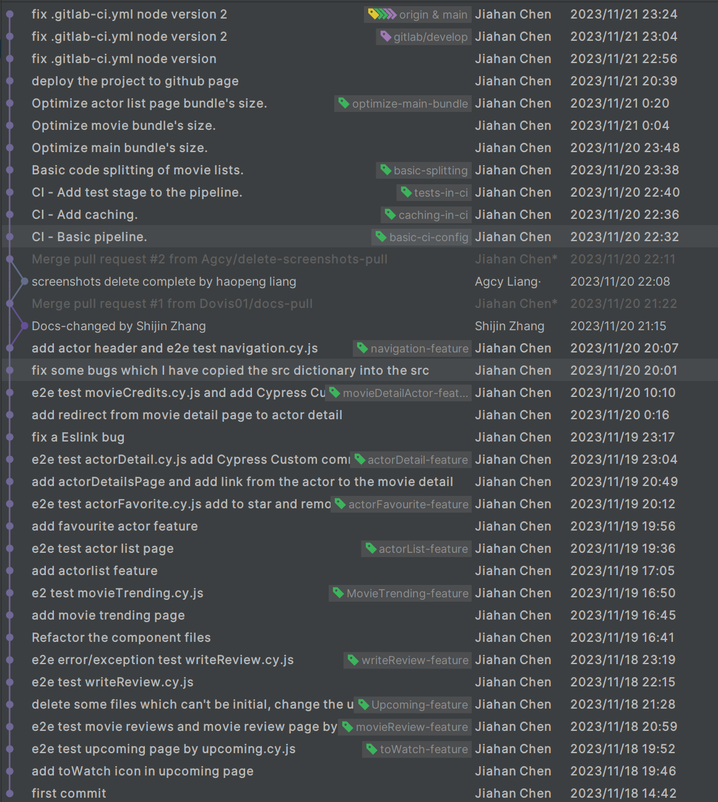
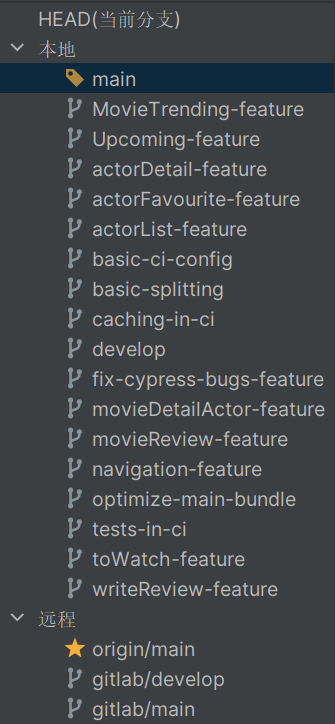
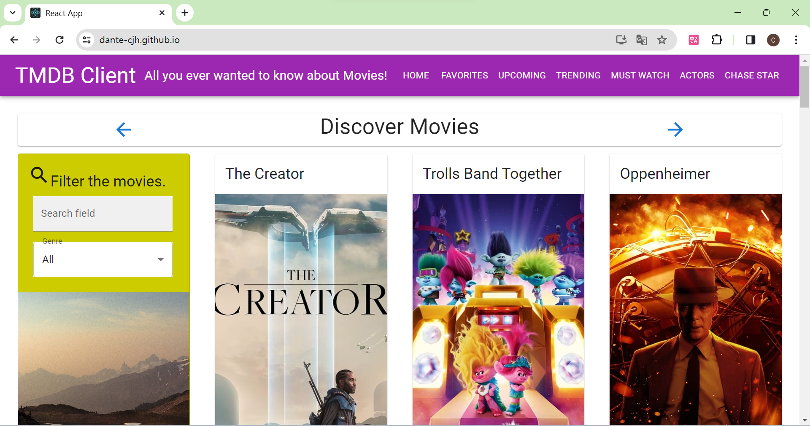
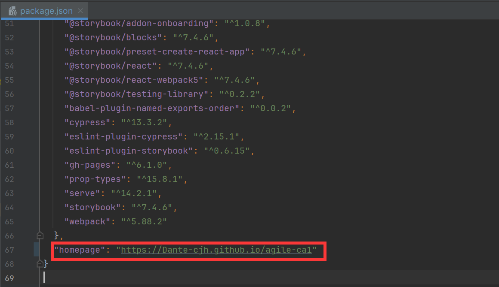

# Assignment 1 - Agile Software Practice.

__Name:__ Jiahan Chen

This repository contains the implementation of a React App, its associated Cypress tests and the GitLab CI pipeline.

## React App Features.

+ Add Day Trending feature which it shows today's most trending movies.
+ Add popular people page and it can link to the specific people details by clicking the people card. We can also filter the actor page by filtering the input name. It can also add the favorite icon to add the people into "Chase Star" page like "Favorite Movies".
+ Add the plus extension like the movie details contains to actors; actor details links to movies

## Automated Tests.

### Unique functionality testing (if relevant).

**Upcoming Movie Page** - The user can find the day trending movies and can watch relevant movie details by clicking the movie card

+ cypress/e2e/upcoming.cy.js

**Movie reviews** - The user can watch reviews of the movie and then click the specific review to see the detail

+ cypress/e2e/movieReview.cy.js

**Must Watch tagging** - The user can tag upcoming movies as their must watch, and those selected are listed on a separate page.

+ cypress/e2e/mustWatch.cy.js

**Write movie reviews** - The user can write the movie reviews from the their favorite movies page.

+ cypress/e2e/writeReview.cy.js

**Day Trending movies page** - The user can watch the day trending movies and can watch relevant movie details by clicking the movie card

- cypress/e2e/movieTrending.cy.js

**Actor page** - The user can watch the popular people

+ cypress/e2e/actorList.cy.js

**Favorite Actor tagging** - The user can tag favorite actors as their chase star, and those selected are listed on a separate page.

+ cypress/e2e/actorFavorite.cy.js

**Actor detail page** - The user can watch the actor details from the actor page and can watch the relevant movies which the actor has acted.

+ cypress/e2e/actorDetail.cy.js

**Movie Credits page** - The user can redirect from the movie details to the actor detail which has acted this movie.

+ cypress/e2e/movieCredits.cy.js

**Navigation site bar** - The user can navigate the movies and actor by the navigation and go back and go on the history.

+ cypress/e2e/navigation.cy.js

### Error/Exception testing (if relevant).

1. Display the Must Watch Movies page when no movies have been tagged.
1. Display the Favorite actor page when no actors have been tagged.
1. Submitting a Movie Review form when the user's name is blank.
1. Submitting a Movie Review form when the review is blank.
1. Submitting a Movie Review form when the review words is short.

### Cypress Custom commands (if relevant).

+ cypress/e2e/movieCredits.cy.js
+ cypress/e2e/actorDetail.cy.js

## Code Splitting.

+ src/index.js
+ src/pages/homePage.js
+ src/pages/actorPage.js
+ src/components/templatePage/templateActorListPage/index.js
+ src/components/templatePage/templateMovieListPage/index.js
+ src/components/actor/actorList/index.js
+ src/components/movie/filterMoviesCard/index.js
+ src/components/movie/movieList/index.js

## Pull Requests.

## Independent learning (If relevant).

